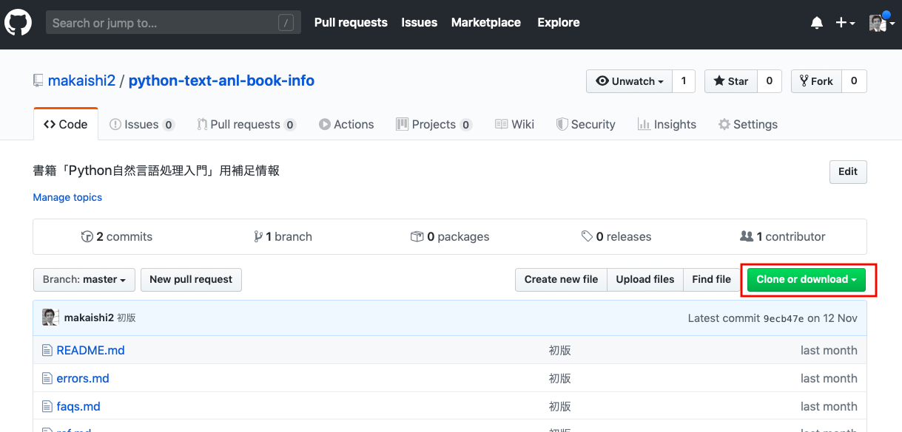
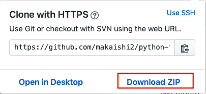

## Notebookファイルダウンロード手順

Notebookファイルをまとめてダウンロードしたい場合は、次の手順に従うのが一番簡単です。

1. [リポジトリトップページ](https://github.com/makaishi2/python-text-anl-book-info)に移動します。

2. 画面右下の「**Clone or download**」のボタンをクリックします。  

3. 「**Download ZIP**」のリンクをクリックします。  

[メインページに戻る](./README.md)